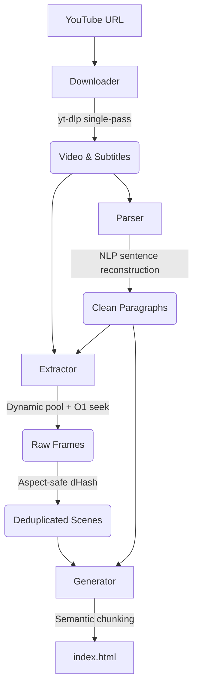

<div align="center">
<pre>
      ▗   ▌     ▗   ▗ 
▌▌▛▌▌▌▜▘▌▌▛▌█▌  ▜▘▚▘▜▘
▙▌▙▌▙▌▐▖▙▌▙▌▙▖▗ ▐▖▞▖▐▖
▄▌                    
</pre>

YouTube you can skim.
</div>

---

Convert YouTube videos into publication-grade, self-contained reading documents with clean transcripts and scene-detected frames.

<div align="center" style="margin: 2rem 0;">
  <video src="https://github.com/user-attachments/assets/012bb00d-2e57-4b40-a8d7-e7bacccf8d88" width="600"></video>
  <p>
    <a href="https://abstraction.github.io/youtube.txt/">View Live Example Preview &rarr;</a>
  </p>
</div>

---

## Philosophy

### Reading is faster than watching

Video dictates consumption speed. A speaker delivers between 130 and 170 words per minute, while a reader absorbs between 250 and 450 words per minute. Watching a 30-minute technical breakdown, product review, or interview forces you into the author's chronological timeline. Pausing, scrubbing, and skipping on a video scrubber are imprecise, high-friction actions.

Text restores autonomy. Readers can scan headings, skip filler, re-read dense arguments, search for exact terms, and extract quotes in seconds. `youtube.txt` converts passive watch time into active reading time.

### Software written with care

Modern web reading is noisy. Pages buckle under tracking scripts, client-side hydration thrash, and intrusive UI animations. The craft of the static document has been buried under unnecessary layers.

`youtube.txt` returns to a durable standard: the pristine, self-contained HTML file. It requires no JavaScript frameworks, makes zero external network requests once loaded, opens instantly, and works offline forever.

### Calm reading for focused minds

Attention is fragile. For readers managing ADHD or high cognitive load, a noisy interface destroys comprehension. Software should guide attention rather than demand it.

We eliminated scroll-spying and accidental hover triggers that cause peripheral flicker. Scrolling is completely quiet and passive. All images rest at full, natural opacity, paired with subtle timestamp badges in each frame corner for effortless, zero-distraction reference.

### The pleasure of inspection

Reading on a screen should be tactile and comfortable. Typography is set in Inter, capping line lengths at a strict 65 characters to maintain optimal eye tracking.

Video frames sit in a balanced bento grid in the right margin, providing immediate visual context. When you need to examine a frame closely, a zero-friction lightbox opens on click and dismisses immediately with a natural scroll. You never have to hunt for a close button.

---

## Key Features

- **Balanced Dynamic Bento Grid:** Adapts compositions cleanly from 1 to 6 images per chapter without awkward thumbnail squishing or layout shifts.
- **Static Semantic Anchoring:** Every visual frame displays an editorial timestamp badge in its corner (e.g. `00:55`), naturally mapping to paragraph timestamps with zero clicks, zero hover, and zero JavaScript.
- **Intentional Focus & Hover Intent:** Dwell filtering (750ms on frames) and single-click paragraph focus illuminate connections only when you ask for them. Scrolling instantly dismisses active states to keep reading uninterrupted.
- **Frictionless Lightbox:** Inspect full-resolution frames with one click. Scroll (`wheel` or `touchmove`) or press `Escape` to instantly dismiss and continue reading.
- **Perceptual dHash Deduplication:** Uses 64-bit difference hashing with letterbox normalization (Hamming distance threshold 4) to prune frozen talking heads while keeping intentional motion and slide transitions.
- **Mid-Paragraph Scene Tracking:** Captures visual cuts that occur during speech (such as brief product close-ups or diagram switches) so context is never dropped.
- **5-Second Fallback Cadence:** Samples intermediate frames during long continuous takes (tutorials, presentations, lectures) to ensure steady visual progression.
- **Native VTT Parsing & Diarization:** Reconstructs natural sentence structures using NLP sentence boundaries, decodes HTML entities, and identifies speaker transitions marked by `>>` cues.
- **Self-Contained Static Output:** Generates a single portable HTML file with inline styles and zero runtime framework dependencies.

---

## Architecture & Pipeline



### 1. Downloader (`src/downloader.ts`)

Executes `yt-dlp` in a single pass (`--no-simulate`, `--print after_move:filepath`) to fetch the best video stream and WebVTT captions simultaneously without redundant API calls.

### 2. Parser (`src/parser.ts`)

Parses caption streams line-by-line:

- **Deduplication:** A sliding-window array strips rolling caption artifacts from auto-generated subtitles.
- **Diarization:** Detects `>>` cues and formats distinct speaker turns.
- **Sanitization:** Decodes common HTML entities (`&amp;`, `&#39;`, `&quot;`) and escapes angle brackets to prevent stored XSS.
- **Sentence Boundaries:** Assembles sentences into natural reading paragraphs (3 to 4 sentences per block) rather than arbitrary timestamp splits.

### 3. Extractor (`src/extractor.ts`)

Extracts and deduplicates video frames in parallel:

- **Fast Seeking:** Places `-ss <timestamp>` before `-i` for instantaneous input seeking in FFmpeg.
- **Worker Pool:** Auto-tunes concurrency based on system CPU core count and available RAM.
- **Scene Detection:** Detects real camera cuts using FFmpeg scene filter (`gt(scene, 0.15)`).
- **Span-Based Fallback:** Samples frames every 5 seconds during continuous takes if no scene cut occurs.
- **Perceptual Deduplication:** Converts frames to 9x8 grayscale with letterbox normalization, generates 64-bit difference hashes, and removes frames within a Hamming distance of 4.

### 4. Generator (`src/generator.ts`)

Compiles paragraphs and frames into static HTML:

- **Semantic Chunking:** Groups paragraphs at natural scene boundaries with an upper bound of 14 paragraphs or 180 seconds per chapter.
- **Asymmetric Desktop Grid:** 65ch reading column anchored on the left; sticky bento visual column on the right.
- **Mobile Flow:** Adapts to a single-column layout on screens `<= 800px` with a horizontal carousel for visual frames.
- **Intentional Focus:** Uses dwell filtering (750ms on frames) and click-to-focus on text so visual correlations only illuminate when requested, keeping scrolling 100% passive and quiet.

---

## Requirements

You need `yt-dlp` and `ffmpeg` installed and available in your system `PATH`.

```bash
# macOS (Homebrew)
brew install yt-dlp ffmpeg

# Arch Linux
sudo pacman -S yt-dlp ffmpeg

# Ubuntu / Debian
sudo apt install ffmpeg
# For yt-dlp on Ubuntu/Debian, install via pip or github release:
sudo wget https://github.com/yt-dlp/yt-dlp/releases/latest/download/yt-dlp -O /usr/local/bin/yt-dlp
sudo chmod a+rx /usr/local/bin/yt-dlp
```

---

## Usage

### Remote Execution (Zero Install)

Run `youtube.txt` directly without cloning the repository or installing anything globally:

```bash
# Using pnpm (Recommended)
pnpm dlx github:abstraction/youtube.txt -u "https://www.youtube.com/watch?v=..." -o "project-folder"

# Using npm
npx github:abstraction/youtube.txt -u "https://www.youtube.com/watch?v=..." -o "project-folder"
```

### Global Installation

Build the package and link it globally:

```bash
git clone https://github.com/abstraction/youtube.txt.git
cd youtube.txt
pnpm install
pnpm run build
pnpm add -g .
```

Run from any directory:

```bash
youtube.txt -u "https://www.youtube.com/watch?v=..." -o "project-folder"
```

### Local Development

Run directly from the repository using `tsx`:

```bash
pnpm install
pnpm run dev -u "https://www.youtube.com/watch?v=..." -o "project-folder"
```

---

## CLI Options

```
Usage: youtube.txt [options]

Create a webpage from a YouTube video with a transcript paired with screenshots

Options:
  -u, --url <url>                URL of the YouTube video (required)
  -o, --out <projectName>        Name of the output project folder (required)
  -c, --concurrency <number>     Number of parallel extraction workers (default: dynamic auto-tuning)
  -t, --threads <number>         FFmpeg threads per worker instance (default: 1)
  -s, --scene-threshold <number> FFmpeg scene detection sensitivity 0-1, lower = more scenes (default: 0.15)
  -h, --help                     Display help for command
```

### Examples

Auto-tuned parallel extraction:

```bash
youtube.txt -u "https://www.youtube.com/watch?v=Od6M0AXpcxQ" -o "iphone-review"
```

High-concurrency extraction for long conferences or lectures:

```bash
youtube.txt -u "https://www.youtube.com/watch?v=..." -o "keynote" -c 16 -t 2
```

Sensitive scene detection for rapid VFX or cinematic edits:

```bash
youtube.txt -u "https://www.youtube.com/watch?v=..." -o "trailer" -s 0.08
```

---

Inspired by [obra's Youtube2Webpage](https://github.com/obra/Youtube2Webpage/).
