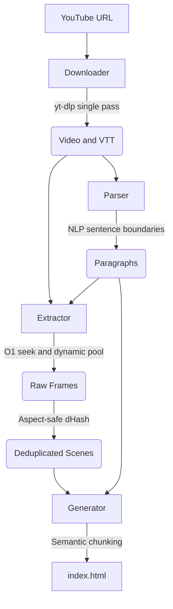

<div align="center">
<pre>
      ▗   ▌     ▗   ▗ 
▌▌▛▌▌▌▜▘▌▌▛▌█▌  ▜▘▚▘▜▘
▙▌▙▌▙▌▐▖▙▌▙▌▙▖▗ ▐▖▞▖▐▖
▄▌                    
</pre>

Convert YouTube videos into static, readable HTML with transcripts and scene-detected frames.
</div>

---

<div align="center" style="margin: 2rem 0;">
  <video src="https://github.com/user-attachments/assets/012bb00d-2e57-4b40-a8d7-e7bacccf8d88" width="600"></video>
  <p>
    <a href="https://abstraction.github.io/youtube.txt/">View live demo &rarr;</a>
  </p>
</div>

---

## Features

- **Static HTML output.** Produces a single file with zero client-side JavaScript libraries. It loads instantly and works offline.
- **Asymmetric layout.** Keeps text measure at 65ch on the left with a sticky 1 to 6 frame image grid on the right.
- **Timestamp badges.** Prints a monospace timestamp tag on each frame for easy cross-referencing with text.
- **Intentional focus.** A 750ms dwell over a frame highlights its matching paragraph. Scrolling clears the highlight.
- **Scroll-to-dismiss lightbox.** Click any image to enlarge it. Scroll to close it and resume reading.
- **Perceptual deduplication.** 64-bit dHash with Hamming distance threshold 4 prunes repetitive talking-head shots while keeping slide changes and product reveals.
- **Mid-paragraph scene capture.** Saves cuts and B-roll that appear while a sentence is being spoken.
- **Periodic fallback sampling.** Takes a frame every 5 seconds during continuous uninterrupted speech.
- **Clean VTT parsing.** Removes rolling caption duplicates, decodes HTML entities, and marks speaker changes.
- **Mobile layout.** Drops to a single column with horizontal scroll-snap carousels on viewports under 800px.

---

## Requirements

Requires `yt-dlp` and `ffmpeg` in your `PATH`.

```bash
# macOS
brew install yt-dlp ffmpeg

# Arch Linux
sudo pacman -S yt-dlp ffmpeg

# Ubuntu / Debian
sudo apt install ffmpeg
sudo wget https://github.com/yt-dlp/yt-dlp/releases/latest/download/yt-dlp -O /usr/local/bin/yt-dlp
sudo chmod a+rx /usr/local/bin/yt-dlp
```

---

## Usage

### Run directly

Use `pnpm dlx` or `npx` without installing globally:

```bash
# pnpm
pnpm dlx github:abstraction/youtube.txt -u "https://www.youtube.com/watch?v=..." -o "output-folder"

# npm
npx github:abstraction/youtube.txt -u "https://www.youtube.com/watch?v=..." -o "output-folder"
```

### Install globally

```bash
git clone https://github.com/abstraction/youtube.txt.git
cd youtube.txt
pnpm install
pnpm run build
pnpm add -g .
```

Run from any directory:

```bash
youtube.txt -u "https://www.youtube.com/watch?v=..." -o "output-folder"
```

### Local development

```bash
pnpm install
pnpm run dev -u "https://www.youtube.com/watch?v=..." -o "output-folder"
```

---

## CLI options

```
Usage: youtube.txt [options]

Options:
  -u, --url <url>                YouTube video URL (required)
  -o, --out <projectName>        Output directory name (required)
  -c, --concurrency <number>     Parallel extraction workers (default: dynamic auto-tuning)
  -t, --threads <number>         FFmpeg threads per worker (default: 1)
  -s, --scene-threshold <number> Scene detection sensitivity 0-1 (default: 0.15, lower = more scenes)
  -h, --help                     Show help
```

### Examples

Default run with automatic resource tuning:

```bash
youtube.txt -u "https://www.youtube.com/watch?v=Od6M0AXpcxQ" -o "review"
```

Higher concurrency for long videos:

```bash
youtube.txt -u "https://www.youtube.com/watch?v=..." -o "lecture" -c 16 -t 2
```

More frequent scene captures:

```bash
youtube.txt -u "https://www.youtube.com/watch?v=..." -o "tutorial" -s 0.08
```

---

## Pipeline



1. **Downloader.** `src/downloader.ts` runs `yt-dlp` in a single pass to fetch video and subtitles together.
2. **Parser.** `src/parser.ts` cleans rolling caption duplicates, decodes entities, and groups sentences into paragraphs.
3. **Extractor.** `src/extractor.ts` runs parallel frame extraction, 5s fallback sampling, and 64-bit dHash deduplication.
4. **Generator.** `src/generator.ts` chunks content into chapters and renders standalone static HTML.

---

Inspired by [obra's Youtube2Webpage](https://github.com/obra/Youtube2Webpage/).
