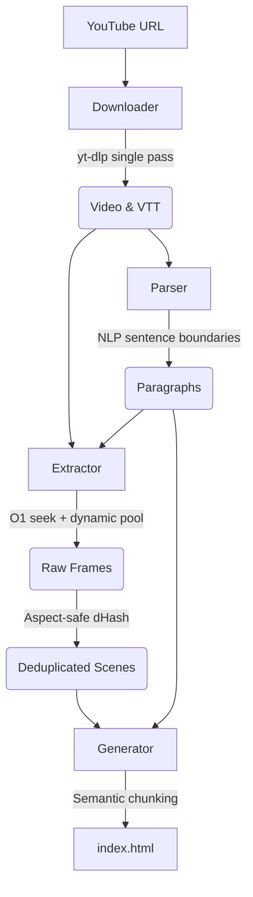

<div align="center">
<pre>
      ▗   ▌     ▗   ▗ 
▌▌▛▌▌▌▜▘▌▌▛▌█▌  ▜▘▚▘▜▘
▙▌▙▌▙▌▐▖▙▌▙▌▙▖▗ ▐▖▞▖▐▖
▄▌                    
</pre>

Convert YouTube videos into static, readable HTML with transcripts and scene-detected frames.
</div>

---

<div align="center" style="margin: 2rem 0;">
  <video src="https://github.com/user-attachments/assets/012bb00d-2e57-4b40-a8d7-e7bacccf8d88" width="600"></video>
  <p>
    <a href="https://abstraction.github.io/youtube.txt/">View Live Demo &rarr;</a>
  </p>
</div>

---

## Features

- **Self-contained static HTML:** Single portable file. Zero runtime JavaScript frameworks. Zero external network requests once loaded. Works offline.
- **Asymmetric bento grid:** 65ch reading column anchored on the left; sticky 1–6 frame image composition on the right.
- **Static timestamp badges:** Monospace timestamp tags (`00:55`) on each frame for passive cross-reference with text timestamps.
- **Intentional focus:** 750ms dwell filter on frames and single-click focus on paragraphs. Any scroll immediately resets active states.
- **Frictionless lightbox:** Click to view full-resolution frame; scroll to dismiss.
- **Perceptual deduplication:** 64-bit dHash (Hamming threshold 4) prunes repetitive talking-head shots while keeping real motion and slides.
- **Mid-paragraph scene capture:** Preserves visual cuts (B-roll, product reveals) occurring mid-sentence.
- **5-second fallback sampling:** Extracts intermediate progress frames during continuous takes.
- **Clean VTT parsing:** Strips rolling caption duplicates, decodes HTML entities, and marks speaker transitions (`>>`).
- **Responsive mobile view:** Single-column layout with horizontal scroll-snap frame carousels on screens ≤800px.

---

## Requirements

Requires `yt-dlp` and `ffmpeg` in your `PATH`.

```bash
# macOS
brew install yt-dlp ffmpeg

# Arch Linux
sudo pacman -S yt-dlp ffmpeg

# Ubuntu / Debian
sudo apt install ffmpeg
# For yt-dlp:
sudo wget https://github.com/yt-dlp/yt-dlp/releases/latest/download/yt-dlp -O /usr/local/bin/yt-dlp
sudo chmod a+rx /usr/local/bin/yt-dlp
```

---

## Usage

### Zero Install (Recommended)

Run directly via `pnpm dlx` or `npx`:

```bash
# pnpm
pnpm dlx github:abstraction/youtube.txt -u "https://www.youtube.com/watch?v=..." -o "output-folder"

# npm
npx github:abstraction/youtube.txt -u "https://www.youtube.com/watch?v=..." -o "output-folder"
```

### Global Install

```bash
git clone https://github.com/abstraction/youtube.txt.git
cd youtube.txt
pnpm install
pnpm run build
pnpm add -g .
```

Run from any directory:

```bash
youtube.txt -u "https://www.youtube.com/watch?v=..." -o "output-folder"
```

### Local Run

```bash
pnpm install
pnpm run dev -u "https://www.youtube.com/watch?v=..." -o "output-folder"
```

---

## CLI Options

```
Usage: youtube.txt [options]

Options:
  -u, --url <url>                YouTube video URL (required)
  -o, --out <projectName>        Output directory name (required)
  -c, --concurrency <number>     Parallel extraction workers (default: dynamic auto-tuning)
  -t, --threads <number>         FFmpeg threads per worker (default: 1)
  -s, --scene-threshold <number> Scene detection sensitivity 0-1 (default: 0.15, lower = more scenes)
  -h, --help                     Show help
```

### Examples

Default run with automatic resource tuning:

```bash
youtube.txt -u "https://www.youtube.com/watch?v=Od6M0AXpcxQ" -o "review"
```

Higher concurrency for long videos:

```bash
youtube.txt -u "https://www.youtube.com/watch?v=..." -o "lecture" -c 16 -t 2
```

More frequent scene captures:

```bash
youtube.txt -u "https://www.youtube.com/watch?v=..." -o "tutorial" -s 0.08
```

---

## Pipeline



1. **Downloader (`src/downloader.ts`):** Single-pass `yt-dlp` fetches video and subtitles simultaneously.
2. **Parser (`src/parser.ts`):** Sliding-window deduplication, entity decoding, and sentence boundary reconstruction.
3. **Extractor (`src/extractor.ts`):** Parallel frame extraction, 5s fallback sampling, and 64-bit dHash deduplication.
4. **Generator (`src/generator.ts`):** Semantic chunking (max 14 paragraphs, max 180s, max 6 frames) into standalone static HTML.

---

Inspired by [obra's Youtube2Webpage](https://github.com/obra/Youtube2Webpage/).
